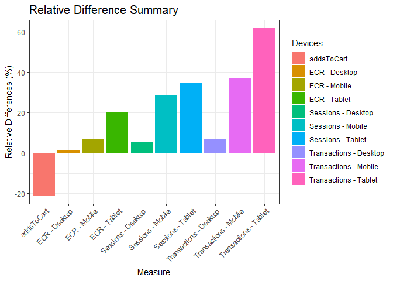

Online Retailer Performance Analysis
================
Saeah Go
2022-07-30

# Packages used

``` r
library(openxlsx)
library(dplyr)
library(tidyr)
library(lubridate)
library(ggplot2)
library(ggpubr)
library(tools)
library(reshape2)
library(zoo)
```

# Load the data

``` r
sessionCounts <- read.csv("C:/Users/Saeah Go/OneDrive/Desktop/IXIS/R Assessment/Dataset/DataAnalyst_Ecom_data_sessionCounts.csv")

addsToCart <- read.csv("C:/Users/Saeah Go/OneDrive/Desktop/IXIS/R Assessment/Dataset/DataAnalyst_Ecom_data_addsToCart.csv")
```

# Preprocessing

Here I checked datatypes for each table and changed some variables’ type
to appropriate format

``` r
# sessionCounts table
str(sessionCounts)
```

    ## 'data.frame':    7734 obs. of  6 variables:
    ##  $ dim_browser       : chr  "Safari" "Internet Explorer" "Chrome" "Amazon Silk" ...
    ##  $ dim_deviceCategory: chr  "tablet" "desktop" "tablet" "tablet" ...
    ##  $ dim_date          : chr  "7/1/12" "7/1/12" "7/1/12" "7/1/12" ...
    ##  $ sessions          : int  2928 1106 474 235 178 120 10 9 5 4 ...
    ##  $ transactions      : int  127 28 3 4 6 7 0 0 0 0 ...
    ##  $ QTY               : int  221 0 13 5 11 0 0 0 0 0 ...

``` r
sessionCounts$dim_date=mdy(sessionCounts$dim_date)

# addsToCart table
str(addsToCart)
```

    ## 'data.frame':    12 obs. of  3 variables:
    ##  $ dim_year  : int  2012 2012 2012 2012 2012 2012 2013 2013 2013 2013 ...
    ##  $ dim_month : int  7 8 9 10 11 12 1 2 3 4 ...
    ##  $ addsToCart: int  191504 217666 123726 139803 186572 168972 147619 135882 109797 183842 ...

``` r
addsToCart<- addsToCart %>% unite(dim_year, dim_month, col = "Date", sep="-")
addsToCart$Date = ymd(paste0(addsToCart$Date, "-01"))
```

# The first sheet (month \* device aggregation)

``` r
firstSheet <- sessionCounts

# drop dim_browser
firstSheet <- subset(firstSheet, select = -dim_browser)

firstSheet <- firstSheet %>% 
  group_by(Date=lubridate::floor_date(dim_date, 'month'), dim_deviceCategory) %>% 
  summarise(
    Sessions = sum(sessions), 
    Transactions = sum(transactions), 
    ECR = (Transactions/Sessions), .groups = 'drop')

# rename column name
colnames(firstSheet)[colnames(firstSheet) == "dim_deviceCategory"] <- "Device"
```

# The second sheet (month over month comparison)

Here I calculated absolute difference, relative difference, variance,
and growth or shrinkage (percentage change). I get the formulas
[here](https://radacad.com/month-over-month-calculation-in-power-bi-using-dax#:~:text=Month%20over%20month%2C%20means%20comparing%20the%20value%20of,can%20use%20different%20functions%20to%20achieve%20the%20result.)
to calculate Month over Month variance and percentage.

``` r
secondSheet <- firstSheet %>% 
  arrange(desc(ymd(firstSheet$Date))) %>% 
  slice(1:6) %>% 
  pivot_wider(names_from = Device, values_from = c(Sessions, Transactions, ECR))

# join two tables
secondSheet <- secondSheet %>% left_join(addsToCart, by = "Date")

secondSheet_t <- data.frame(t(secondSheet))
colnames(secondSheet_t) = secondSheet_t[1,] # date row will be the header
secondSheet_t = secondSheet_t[-1,] # remove the date row

# convert values from char to numeric 
secondSheet_t <- mutate_all(secondSheet_t, function(x) as.numeric(x))

# month over month comparison
secondSheet_t <- secondSheet_t %>% 
  mutate(
    mom_var = `2013-06-01`-`2013-05-01`, # MOM variance
    mom_perc = mom_var - `2013-05-01`, # MOM percentage (growth or shrinking)
    abs_diff = abs(`2013-06-01`-`2013-05-01`), # absolute difference
    rel_diff = (`2013-06-01`-`2013-05-01`)/`2013-05-01` * 100 # relative difference 
  )
```

# Visualize results

``` r
secondSheet_t_vis <- cbind(Devices = rownames(secondSheet_t), secondSheet_t)
rownames(secondSheet_t_vis) <- 1:nrow(secondSheet_t_vis)
```

### Month Over Month (June & May ECR Comparison)

``` r
vis_data_ECR <- secondSheet_t_vis %>% 
  filter(grepl('ECR', Devices)) %>% 
  select(c(1,2,3)) %>% 
  melt(id.vars = 'Devices', variable.name = 'Month', value.name = 'ECR') 

# change the Month column from mdy format to my format
vis_data_ECR$Month <- as.Date(vis_data_ECR$Month)
vis_data_ECR$Month <- format(vis_data_ECR$Month,"%Y-%m")

# change the device column values
vis_data_ECR$Devices <- gsub("ECR_", "", vis_data_ECR$Devices) # remove ECR_ part 
vis_data_ECR$Devices <- toTitleCase(vis_data_ECR$Devices) # capitalize

ggplot(vis_data_ECR, aes(x = Devices, y = ECR, shape = Month, color = Month)) +
  geom_point(size = 6) +
  theme_bw() +
  scale_color_manual(values = c('2013-06' = "red", '2013-05' = "blue")) +
  scale_shape_manual(values = c('2013-06' = 16, '2013-05' = 16)) +
  ggtitle("Month over Month Summary") +
  labs(subtitle = "May 2013, June 2013 ECR Summary by Devices") +
  xlab("Devices") + ylab("ECR") +
  theme(legend.position = "right",
        plot.title = element_text(size = 15))
```

<!-- -->

``` r
ggsave("ECR Summary.jpeg", width = 5, height = 6)
```

### Month Over Month (Variance)

``` r
# change the device column values
vis_data_abs_diff <- secondSheet_t_vis %>% 
  filter(!grepl('ECR', Devices))
vis_data_abs_diff$Devices <- gsub("_", " - ", vis_data_abs_diff$Devices) 
vis_data_abs_diff$Devices <- toTitleCase(vis_data_abs_diff$Devices) # capitalize

ggplot(vis_data_abs_diff, aes(Devices, mom_var, fill = Devices)) +
  geom_bar(stat = "identity", position = "dodge") +
  xlab("Measure") + ylab("Variance") +
  ggtitle("Variance Summary") +
  labs(subtitle = "Sessions, Transactions, and AddsToCart") +
  theme_bw() +
  theme(axis.text.x = element_text(angle = 45, hjust = 1),
        legend.position = "right",
        plot.title = element_text(size = 15)) 
```

<!-- -->

``` r
ggsave("Variance Summary.jpeg", width = 8, height = 6)
```

### Month Over Month (Relative Difference)

Note that relative difference = (`2013-06-01`-`2013-05-01`)/`2013-05-01`
\* 100 This shows us month over month growth rate (percentage change)

``` r
# change the device column values
vis_data_rel_diff <- secondSheet_t_vis
vis_data_rel_diff$Devices <- gsub("_", " - ", vis_data_rel_diff$Devices) 
vis_data_rel_diff$Devices <- toTitleCase(vis_data_rel_diff$Devices) # capitalize

ggplot(vis_data_rel_diff, aes(Devices, rel_diff, fill = Devices)) +
  geom_bar(stat = "identity", position = "dodge") +
  xlab("Measure") + ylab("Relative Differences (%)") +
  ggtitle("Relative Difference Summary") +
  theme_bw() +
  theme(axis.text.x = element_text(angle = 45, hjust = 1),
        legend.position = "right",
        plot.title = element_text(size = 15)) 
```

<!-- -->

``` r
ggsave("Rel Diff Summary.jpeg", width = 8, height = 6)
```

# Export

``` r
str(firstSheet)
```

    ## tibble [36 × 5] (S3: tbl_df/tbl/data.frame)
    ##  $ Date        : Date[1:36], format: "2012-07-01" "2012-07-01" ...
    ##  $ Device      : chr [1:36] "desktop" "mobile" "tablet" "desktop" ...
    ##  $ Sessions    : int [1:36] 335429 274443 158717 392079 275556 154858 272771 220689 169193 302682 ...
    ##  $ Transactions: int [1:36] 10701 2576 4884 12912 3165 3202 8898 2381 4379 9373 ...
    ##  $ ECR         : num [1:36] 0.0319 0.00939 0.03077 0.03293 0.01149 ...

``` r
# convert from mmddyyyy to mmyyyy format for the first sheet
firstSheet$Date <- format(firstSheet$Date, "%m-%Y")

str(secondSheet_t)
```

    ## 'data.frame':    10 obs. of  6 variables:
    ##  $ 2013-06-01: num  554940 526481 307413 19370 7412 ...
    ##  $ 2013-05-01: num  526330 409796 228513 18176 5413 ...
    ##  $ mom_var   : num  28610 116685 78900 1194 1999 ...
    ##  $ mom_perc  : num  -497720 -293111 -149613 -16982 -3414 ...
    ##  $ abs_diff  : num  28610 116685 78900 1194 1999 ...
    ##  $ rel_diff  : num  5.44 28.47 34.53 6.57 36.93 ...

``` r
# rename column name
colnames(secondSheet_t)[colnames(secondSheet_t) == "2013-06-01"] <- "06-2013"
colnames(secondSheet_t)[colnames(secondSheet_t) == "2013-05-01"] <- "05-2013"

excel_sheet <- list('Sheet1' = firstSheet, 'Sheet2' = secondSheet_t)
write.xlsx(excel_sheet, file = 'OnlineRetailerPerformanceAnalysis.xlsx')
```
